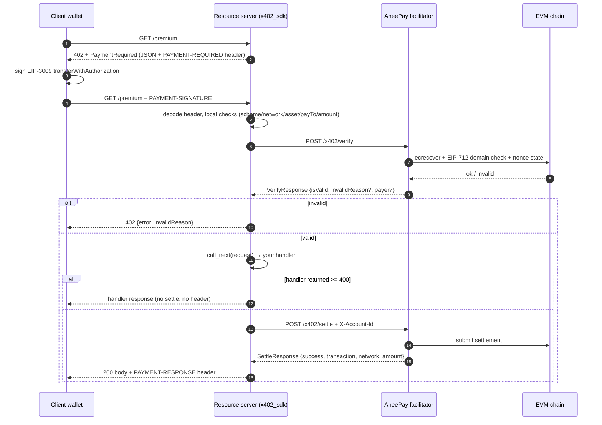

# aneepay-x402

[](https://pypi.org/project/aneepay-x402/)
[](https://pypi.org/project/aneepay-x402/)
[](LICENSE)
[](https://github.com/astral-sh/ruff)

Merchant-side Python SDK that implements the **[x402](https://x402.org) protocol (wire
v2, `exact` scheme on EVM)** for the **[AneePay](https://aneepay.com) non-custodial crypto
gateway/facilitator**.

The package turns any ASGI resource server into a paid API: it answers
`402 Payment Required` with a machine-readable x402 offer, verifies the client's
EIP-3009 `TransferWithAuthorization` signature through the AneePay facilitator,
runs your handler, and settles the payment on-chain — with **no private keys and no
funds held by the SDK or the server**.

> **Status: alpha.** x402 **v2 only**. API and error messages may change before 1.0.
> Supported scheme: `exact`. Supported networks: EVM only (`eip155:<chainId>`).

---

## Table of contents

- [Why this package exists](#why-this-package-exists)
- [How the protocol works](#how-the-protocol-works)
- [Installation](#installation)
- [Quickstart](#quickstart)
  - [1. Configure the gateway clone](#1-configure-the-gateway-clone)
  - [2. Build the payment offer](#2-build-the-payment-offer)
  - [3. Protect routes](#3-protect-routes)
  - [4. Test it](#4-test-it)
- [What is on the wire](#what-is-on-the-wire)
- [Per-route pricing](#per-route-pricing)
- [One shared facilitator client](#one-shared-facilitator-client)
- [Talking to the facilitator directly](#talking-to-the-facilitator-directly)
- [API reference](#api-reference)
  - [Configuration models](#configuration-models)
  - [Offer and payload builders](#offer-and-payload-builders)
  - [Amount helpers](#amount-helpers)
  - [Header codecs](#header-codecs)
  - [Middleware](#middleware)
  - [Facilitator client](#facilitator-client)
  - [Errors](#errors)
- [Wire format reference](#wire-format-reference)
- [Behaviour and caveats](#behaviour-and-caveats)
- [Testing and mocking](#testing-and-mocking)
- [Project layout](#project-layout)
- [Development](#development)
- [Security notes](#security-notes)
- [Troubleshooting / FAQ](#troubleshooting--faq)
- [License](#license)

---

## Why this package exists

x402 is an open standard for HTTP-native payments: instead of an API key, a client
answers a `402 Payment Required` response with a signed payment authorization. The
server verifies and settles it, and only then the request proceeds.

Doing that by hand means three non-obvious jobs:

1. **Amount arithmetic.** Prices are human units (`0.01`), the wire format is token
   atomic units as a **string** (`"10000"`). Floats cannot do this safely.
2. **Signature verification and settlement.** That needs chain access, an EIP-712
   domain, replay protection, and a policy for who may settle. AneePay already runs
   that as a **non-custodial facilitator/gateway**: your merchant gets a dedicated
   *gateway clone* contract address, the payer signs with their own wallet, and the
   facilitator broadcasts the settlement.
3. **Ordering.** Verify → serve → settle, with the correct failure semantics for each
   step.

`aneepay-x402` is those three jobs as a library. It deliberately does **not** touch
the private key: the client wallet signs, your server never sees a key, and the
facilitator never takes custody.

The SDK is **self-contained** — `httpx`, `pydantic` and `starlette` only. It does not
import from the rest of the AneePay monorepo, and the x402 wire schemas are
vendored on purpose and pinned by a contract test (see
[Wire format reference](#wire-format-reference)).

> This package is **not** the upstream [`x402`](https://pypi.org/project/x402/)
> Python client library. It speaks the same protocol but targets the AneePay
> facilitator contract (extra `X-Account-Id` account scoping, `/x402/*` endpoints).

## How the protocol works

| Step | Actor | HTTP |
| --- | --- | --- |
| 1. Unpaid request | client → your server | `GET /premium` |
| 2. Offer | your server → client | `402` + JSON body + `PAYMENT-REQUIRED` header (same body, base64) |
| 3. Signed payment | client → your server | `GET /premium` + `PAYMENT-SIGNATURE` header (base64 JSON) |
| 4. Verify | your server → facilitator | `POST {facilitator}/x402/verify` |
| 5. Serve | your server | `200` body of your handler (unchanged) |
| 6. Settle | your server → facilitator | `POST {facilitator}/x402/settle` + `X-Account-Id` |
| 7. Receipt | your server → client | same body + `PAYMENT-RESPONSE` header |

The client only ever learns about the facilitator through the verification result —
the client does **not** call the facilitator itself, and your server is the only
party that holds the merchant account identity.

<details>
<summary>Sequence diagram</summary>



</details>

## Installation

```bash
pip install aneepay-x402
```

With [uv](https://docs.astral.sh/uv/):

```bash
uv add aneepay-x402
```

Requirements: **Python 3.10+**, any EVM chain reachable by the facilitator, and a
AneePay account whose `account_id` is a UUID. The SDK talks to the facilitator over
plain HTTP/HTTPS via `httpx`; TLS termination is the facilitator's job.

## Quickstart

### 1. Configure the gateway clone

`PaymentConfig` describes *who* is paid and *where* verification goes. It contains no
secrets.

```python
from uuid import UUID

from x402_sdk import PaymentConfig, TokenConfig

payments = PaymentConfig(
    facilitator_url="https://facilitator.aneepay.com",
    account_id=UUID("2f1c2a3b-6f3d-4f7a-9b21-0a6b3f5d1c90"),  # your AneePay account
    network="eip155:8453",  # CAIP-2: Base mainnet
    pay_to="0x1111111111111111111111111111111111111111",  # your gateway clone
    token=TokenConfig(
        address="0x833589fcd6edb6e08f4c7c32d4f71b54bda02913",  # USDC on Base
        decimals=6,
        name="USD Coin",
    ),
    resource_url="https://api.example.com/premium",  # required to build an offer
    description="Premium dataset",
)
```

<details>
<summary>Configuration field reference</summary>

`PaymentConfig` (`extra="forbid"` — unknown keys are rejected):

| Field | Type | Default | Notes |
| --- | --- | --- | --- |
| `facilitator_url` | `str` | — | Base URL, e.g. `http://localhost:8080`. A trailing `/` is normalized away. |
| `account_id` | `UUID` | — | AneePay account; a `str` is coerced to `UUID`. Sent as `X-Account-Id` on **settle only**. |
| `network` | `str` | — | CAIP-2, must match `^eip155:\d+$` (EVM only). |
| `pay_to` | `str` | — | Recipient address `^0x[a-fA-F0-9]{40}$` — the per-merchant **gateway clone**, not your own wallet. |
| `token` | `TokenConfig` | — | Asset to charge. |
| `resource_url` | `str \| None` | `None` | Default `ResourceInfo.url`. Required (directly or per offer) to build a `PaymentRequired`. |
| `description` | `str \| None` | `None` | Default `ResourceInfo.description`. |
| `mime_type` | `str` | `"application/json"` | Default `ResourceInfo.mimeType`. |
| `max_timeout_seconds` | `int` | `60` | `maxTimeoutSeconds` in the offer; `ge=1`. Per-offer override supported. |
| `request_timeout_seconds` | `float` | `10.0` | `httpx` timeout for facilitator calls; `gt=0`. |
| `supported_path` | `str` | `/x402/supported` | Override if your deployment mounts the API elsewhere. |
| `verify_path` | `str` | `/x402/verify` | Same. |
| `settle_path` | `str` | `/x402/settle` | Same. |

Read-only properties: `supported_url`, `verify_url`, `settle_url` — each
`facilitator_url.rstrip("/") + path`.

`TokenConfig` (`extra="forbid"`):

| Field | Type | Default | Notes |
| --- | --- | --- | --- |
| `address` | `str` | — | ERC-20 contract, `^0x[a-fA-F0-9]{40}$`. |
| `decimals` | `int` | `6` | `0 <= decimals <= 36`. Drives price → atomic conversion. |
| `name` | `str` | — | EIP-712 domain **name** of the token. Must match the token contract exactly, or signatures will not verify. |
| `version` | `str` | `"2"` | EIP-712 domain **version**, same caveat. |

</details>

### 2. Build the payment offer

```python
from x402_sdk import build_payment_required

offer = build_payment_required(payments, price="0.01")  # 0.01 USDC = 10000 atomic units
```

Build it **once at startup**, not per request: the offer is static data, and reusing
one object avoids re-deriving the amount on every 402.

### 3. Protect routes

`require_payment` is a plain Starlette-style HTTP dispatch, so it plugs into
`BaseHTTPMiddleware`, `app.middleware("http")`, `add_middleware`, or any ASGI stack
built on those primitives (Starlette, FastAPI, ...).

```python
from starlette.applications import Starlette
from starlette.middleware import Middleware
from starlette.middleware.base import BaseHTTPMiddleware
from starlette.responses import JSONResponse
from starlette.routing import Route

from x402_sdk import require_payment

OFFERS = {"/premium": offer}


def payment_dispatch(request, call_next):
    """Apply the offer only to priced routes; everything else stays public."""
    current = OFFERS.get(request.url.path)
    if current is None:
        return call_next(request)
    return require_payment(payments, current)(request, call_next)


async def premium(request):
    return JSONResponse({"data": "paid content"})


async def health(request):
    return JSONResponse({"status": "ok"})


app = Starlette(
    routes=[Route("/premium", premium), Route("/health", health)],
    middleware=[Middleware(BaseHTTPMiddleware, dispatch=payment_dispatch)],
)
```

With FastAPI the same dispatch is installed as a middleware, and the offers are built
from your route table:

```python
from fastapi import FastAPI
from x402_sdk import build_payment_required, require_payment

app = FastAPI()

OFFERS = {
    "/v1/report": build_payment_required(payments, price="0.05"),
    "/v1/search": build_payment_required(payments, price="0.001", max_timeout_seconds=30),
}


@app.middleware("http")
async def x402_middleware(request, call_next):
    current = OFFERS.get(request.url.path)
    if current is None:
        return await call_next(request)
    return await require_payment(payments, current)(request, call_next)
```

> **Route filtering is your job.** `require_payment` has no allowlist: it enforces the
> offer for *every* request it sees. Filter by path (as above), or mount a separate
> ASGI app / router for paid traffic.

### 4. Test it

Unpaid request:

```bash
curl -i http://127.0.0.1:8000/premium
# HTTP/1.1 402 Payment Required
# content-type: application/json
# PAYMENT-REQUIRED: eyJ4NDAyVmVyc2lvbiI6MiwicmVzb3VyY2UiOnsidXJsIjoiaHR0cHM6...
```

Paid request (a real x402 client performs this for you; the header is
base64-encoded JSON):

```bash
curl -i http://127.0.0.1:8000/premium \
  -H 'PAYMENT-SIGNATURE: eyJ4NDAyVmVyc2lvbiI6MiwicGF5bG9hZCI6eyJzaWduYXR1cmUiOiIweHh4In19'
# HTTP/1.1 200 OK
# PAYMENT-RESPONSE: eyJzdWNjZXNzIjp0cnVlLCJ0cmFuc2FjdGlvbiI6IjB4ZGVhZGJlZWYiLCJu...
```

## What is on the wire

The `402` response body, and the same document base64-encoded in the
`PAYMENT-REQUIRED` header. This is the real output of
`build_payment_required(payments, price="0.01")` for the quickstart config above:

```json
{
  "x402Version": 2,
  "resource": {
    "url": "https://api.example.com/premium",
    "description": "Premium dataset",
    "mimeType": "application/json"
  },
  "accepts": [
    {
      "scheme": "exact",
      "network": "eip155:8453",
      "amount": "10000",
      "asset": "0x833589fcd6edb6e08f4c7c32d4f71b54bda02913",
      "payTo": "0x1111111111111111111111111111111111111111",
      "maxTimeoutSeconds": 60,
      "extra": {
        "name": "USD Coin",
        "version": "2",
        "assetTransferMethod": "eip3009"
      }
    }
  ],
  "extensions": {}
}
```

Notes on this document:

- `amount` is a **string** in atomic units. `0.01` × 10⁶ = `"10000"`.
- `extra.name` / `extra.version` are the token's EIP-712 domain fields; clients copy
  them into the signature. Wrong values ⇒ every signature fails verification.
- `error` is **absent** in a plain "you must pay" offer. It is only present when you
  pass `error=...` (e.g. a validation error on a paid endpoint), in which case it
  appears in both the body and the header.
- `extensions` is always `{}` unless you populate it yourself.

The client's `PAYMENT-SIGNATURE` header (decoded) is a `PaymentPayload`: the chosen
option under `accepted`, the EIP-3009 signature under `payload`, plus optional echoes
of `resource` / `extensions`. Your server's success response gains a
`PAYMENT-RESPONSE` header:

```json
{
  "success": true,
  "transaction": "0xdeadbeef",
  "network": "eip155:8453",
  "amount": "10000",
  "extensions": {}
}
```

## Per-route pricing

Because an offer is a plain immutable-ish value object, per-route pricing is a matter
of building one offer per route. No middleware stack, no per-route wrapper:

```python
from x402_sdk import build_resource_info, build_payment_required

REPORT = build_payment_required(
    payments,
    price="0.05",
    resource=build_resource_info(
        payments,
        resource_url="https://api.example.com/v1/report",
        description="Full report",
        mime_type="application/json",
    ),
    max_timeout_seconds=30,
)

SEARCH = build_payment_required(
    payments,
    price="0.001",
    resource=build_resource_info(
        payments,
        resource_url="https://api.example.com/v1/search",
    ),
)
```

`build_resource_info` falls back to the `PaymentConfig` defaults
(`resource_url`, `description`, `mime_type`) for any argument you omit, and raises
`ConfigError` if no `resource_url` can be resolved from either source — the wire
schema requires `resource.url`.

## One shared facilitator client

`require_payment(..., client=None)` creates a **fresh `httpx.AsyncClient` per
request** (and closes it in a `finally`). That is correct but wasteful: no connection
reuse, a new TLS handshake per request. Pass a long-lived client to fix both.

```python
import httpx
from x402_sdk import X402FacilitatorClient

facilitator = X402FacilitatorClient(payments, client=httpx.AsyncClient(timeout=10.0))

app = Starlette(
    ...,
    middleware=[Middleware(BaseHTTPMiddleware, dispatch=require_payment(payments, offer, client=facilitator))],
)
```

The middleware only needs three methods on the object you pass — `verify(payload) -> VerifyResponse`,
`settle(payload) -> SettleResponse`, and `aclose()`. Duck-typing is intentional and is
what the test-suite fakes.

Lifecycle rules:

- Pass your own `httpx.AsyncClient` → `aclose()` is a **no-op**; you own closing it
  (wire it to your app's shutdown event).
- Pass `client=None` → the SDK creates and closes the client around the request.
- If you create the `X402FacilitatorClient` yourself without an `httpx` client, its
  internal client is lazy and closed by `aclose()`; `async with` is supported.

## Talking to the facilitator directly

Use the client when you need a pre-flight capability check, or to drive
verify/settle yourself (e.g. a CLI or a batch job).

```python
import asyncio

from x402_sdk import X402FacilitatorClient
from x402_sdk.schemas import SupportedResponse


async def main() -> None:
    async with X402FacilitatorClient(payments) as facilitator:
        supported: SupportedResponse = await facilitator.supported()
        for kind in supported.kinds:
            print(kind.scheme, kind.network, kind.extra)
        print(supported.extensions, supported.signers)


asyncio.run(main())
```

```python
from x402_sdk import build_payment_request, decode_payment_signature_header

payload = decode_payment_signature_header(request.headers["PAYMENT-SIGNATURE"])
verify = await facilitator.verify(build_payment_request(payload, offer.accepts[0]))
if not verify.is_valid:
    ...  # verify.invalid_reason
receipt = await facilitator.settle(build_payment_request(payload, offer.accepts[0]))
print(receipt.transaction, receipt.amount, receipt.network)
```

`SettleResponse.transaction` is a **string** and may be empty when the facilitator
did not broadcast anything — do not assume it is a hash.

## API reference

Everything below is importable from the package root unless noted.

### Configuration models

```python
TokenConfig(*, address: str, decimals: int = 6, name: str, version: str = "2")
PaymentConfig(*, facilitator_url: str, account_id: UUID | str, network: str,
              pay_to: str, token: TokenConfig, resource_url: str | None = None,
              description: str | None = None, mime_type: str = "application/json",
              max_timeout_seconds: int = 60,
              supported_path: str = "/x402/supported",
              verify_path: str = "/x402/verify",
              settle_path: str = "/x402/settle",
              request_timeout_seconds: float = 10.0)
```

Validated eagerly (invalid address/network/decimals ⇒ `pydantic.ValidationError` at
construction, not at request time). Unknown fields are rejected. See the field tables
in [Quickstart](#1-configure-the-gateway-clone).

### Offer and payload builders

```python
build_requirements(config, *, price, max_timeout_seconds=None) -> PaymentRequirements
build_resource_info(config, *, resource_url=None, description=None, mime_type=None) -> ResourceInfo
build_payment_required(config, *, price, resource=None, error=None, max_timeout_seconds=None) -> PaymentRequired
build_payment_request(payment_payload, payment_requirements) -> PaymentRequest
```

| Function | Behaviour |
| --- | --- |
| `build_requirements` | `scheme="exact"`, network/asset/`pay_to` from config, `amount=build_amount(price, token.decimals)`, `maxTimeoutSeconds` = override or config value, `extra` = token `name`/`version` (→ `assetTransferMethod: "eip3009"`). |
| `build_resource_info` | Per-field fallback to `config.resource_url` / `config.description` / `config.mime_type`. Raises `ConfigError("resource_url is required to build PaymentRequired")` if no URL is available. |
| `build_payment_required` | Combines the two above. `error` is injected into both the body and the `PAYMENT-REQUIRED` header (and dropped entirely when `None`). |
| `build_payment_request` | The `/x402/verify` and `/x402/settle` body: `{x402Version, paymentPayload, paymentRequirements}`. Structurally identical for both calls. |

All arguments after `config` are keyword-only.

### Amount helpers

```python
build_amount(price: Decimal | int | str, decimals: int) -> str
parse_amount(amount: str | int, decimals: int) -> Decimal
```

`build_amount` converts human units to atomic units **as a string**, and raises
`AmountError` when the price is negative, not a valid decimal number
(`"abc"`, `""`, `None`), or carries more precision than `decimals` allows. It
converts via `Decimal(str(price))`, which is why `"0.1"`, `1`, and `Decimal("0.1")`
behave identically — and why `0.1 + 0.2` does **not**:

```python
build_amount("0.01", 6)  # "10000"
build_amount(1, 6)  # "1000000"
build_amount(0.1, 6)  # "100000"   (uses str(0.1) == "0.1")
build_amount("1e-3", 6)  # "1000"
build_amount(0.1 + 0.2, 6)  # AmountError (str is "0.30000000000000004")
```

**Never pass a float expression.** Use `str`, `int`, or `Decimal` at the source (for
example `Decimal(str(row.price))`, or a price table of strings). This is the single
most common integration bug in x402 integrations.

`parse_amount` is the inverse for display and accounting: it does **not** require the
value to be an integer, so `parse_amount("10000.5", 6) == Decimal("0.0100005")`.

### Header codecs

```python
encode_payment_required_header(required: PaymentRequired) -> str
encode_payment_response_header(response: SettleResponse) -> str
decode_payment_signature_header(value: str) -> PaymentPayload
```

All three are **base64 of compact JSON** (`separators=(",", ":")`, no whitespace).
`decode_payment_signature_header` converts *every* failure — invalid base64, invalid
JSON, schema mismatch — into `PaymentError` with a message that is safe to return to
the client in the 402 `error` field. It never raises `binascii.Error` or
`pydantic.ValidationError`.

```python
encode_payment_required_header(offer)
# '{"x402Version":2,"resource":{...},"accepts":[...],"extensions":{}}'  -> base64
```

### Middleware

```python
require_payment(config: PaymentConfig, payment_required: PaymentRequired, *,
                client=None) -> Callable[[Request, Callable[[Request], Awaitable[Response]]], Awaitable[Response]]
```

Returns a Starlette-style dispatch coroutine. At construction time it:

- raises `ConfigError` if `payment_required.accepts` is empty;
- freezes the enforcement object, pinning requirements to **`accepts[0]`** — only the
  first accepted option is enforced.

Per request the order is: missing `PAYMENT-SIGNATURE` → 402 → decode →
local validation → `/verify` → (invalid) 402 → your handler → (status ≥ 400) return
the handler response untouched, without settling → `/settle` → (failed) 402 →
otherwise 200 with `PAYMENT-RESPONSE`.

Local validation (before spending a facilitator round-trip) rejects, in this order:
non-`exact` scheme, wrong network, wrong `asset`, wrong `payTo` (both
case-insensitive), an `amount` that is not byte-identical to the offered string,
`authorization.to != config.pay_to` (case-insensitive), and
`authorization.value != requirements.amount` (exact).

Everything security-relevant beyond that — signature validity, payer identity, nonce
replay, `validAfter` / `validBefore` windows — is delegated to the facilitator. This
is deliberate: the SDK has no chain access, so it cannot check signatures.

### Facilitator client

```python
X402FacilitatorClient(config, client: httpx.AsyncClient | None = None)
# .supported() -> SupportedResponse                       GET  {supported_url}
# .verify(request) -> VerifyResponse                     POST {verify_url}
# .settle(request) -> SettleResponse                     POST {settle_url} + X-Account-Id
# .aclose() -> None                                      closes only an owned client
# async with X402FacilitatorClient(config) as f: ...
```

- Only `settle` sends `X-Account-Id: <account_id>`; `verify` sends no extra headers.
- Transport failures and HTTP ≥ 400 become `FacilitatorError` with the URL and the
  response text in the message.
- A **malformed facilitator response body** (valid JSON, wrong shape) raises
  `pydantic.ValidationError`, *not* `FacilitatorError` — response models are validated
  after the HTTP check. Catch both if a facilitator may be misconfigured or
  version-skewed.
- `aclose()` is idempotent and never closes a client you passed in.

### Errors

```text
X402Error                 (base for everything below)
├── ConfigError           bad/insufficient configuration
├── AmountError           price → atomic conversion failed
├── PaymentError          malformed PAYMENT-SIGNATURE header
└── FacilitatorError      facilitator transport/HTTP failure
```

Config/amount problems are raised **synchronously at build time**; payment problems
become a `402` with the message in `error`; facilitator problems become a `402` with
`str(exc)` in `error`.

## Wire format reference

The schemas in `x402_sdk.schemas` are a **vendored duplicate** of the contract owned by
the AneePay facilitator, pinned by `tests/test_wire_contract.py`. They are
deliberately not imported from the monorepo (the SDK must stay installable on its own)
and deliberately strict: every model is `extra="forbid"` and rejects unknown keys, so
a facilitator that adds a field will surface loudly instead of silently.

Models accept both python names (`pay_to`) and wire aliases (`payTo`); serialize with
`to_wire(model)` to get camelCase with `None` dropped.

| Model | Wire keys | Notes |
| --- | --- | --- |
| `ResourceInfo` | `url`, `description`, `mimeType`, `serviceName`, `tags`, `iconUrl` | `url` required; `serviceName` ≤ 32 chars, `tags` ≤ 5, `iconUrl` ≤ 2048. |
| `Extension` | `info`, `schema` | One entry of an `extensions` map. |
| `PaymentRequirementsExtra` | `name`, `version`, `assetTransferMethod` | `extra="allow"` here — scheme keys pass through. `assetTransferMethod` defaults to `eip3009`. |
| `PaymentRequirements` | `scheme`, `network`, `amount`, `asset`, `payTo`, `maxTimeoutSeconds`, `extra` | `amount` is a string. |
| `PaymentRequired` | `x402Version`, `error`, `resource`, `accepts`, `extensions` | `x402Version` is `Literal[2]`. |
| `Eip3009Authorization` | `from`, `to`, `value`, `validAfter`, `validBefore`, `nonce` | All six required; times and nonce are **strings**. |
| `ExactEvmPayload` | `signature`, `authorization` | 65-byte EIP-712 `transferWithAuthorization` signature. |
| `PaymentPayload` | `x402Version`, `resource`, `accepted`, `payload`, `extensions` | What the client signs and sends. |
| `PaymentRequest` | `x402Version`, `paymentPayload`, `paymentRequirements` | Body of `/verify` and `/settle`; `VerifyRequest` / `SettleRequest` are aliases of it. |
| `VerifyResponse` | `isValid`, `invalidReason`, `payer`, `extensions`, `extra` | |
| `SettleResponse` | `success`, `errorReason`, `payer`, `transaction`, `network`, `amount`, `extensions` | `transaction` required (may be empty). |
| `SupportedKind` | `x402Version`, `scheme`, `network`, `extra` | |
| `SupportedResponse` | `kinds`, `extensions`, `signers` | `signers` maps CAIP-2 patterns like `eip155:*` to signer addresses. |

Constants: `X402_VERSION = 2`, `SCHEME_EXACT = "exact"`,
`ASSET_TRANSFER_METHOD_EIP3009 = "eip3009"`, and the headers
`HEADER_PAYMENT_REQUIRED = "PAYMENT-REQUIRED"`,
`HEADER_PAYMENT_SIGNATURE = "PAYMENT-SIGNATURE"`,
`HEADER_PAYMENT_RESPONSE = "PAYMENT-RESPONSE"`.

Header names are HTTP case-insensitive; clients may send them in any case. The
constants are exported for building your own headers and tests.

`ResourceInfo`, `Extension`, `PaymentRequirementsExtra`, `Eip3009Authorization`,
`ExactEvmPayload`, `PaymentRequest`, `VerifyRequest`, `SettleRequest`,
`SupportedKind`, `SupportedResponse` and `HEADER_PAYMENT_RESPONSE` are **not**
re-exported at the package root — import them from `x402_sdk.schemas`.

<details>
<summary>Error codes you will see in a 402 <code>error</code> field</summary>

Codes originate from the facilitator (`VerifyResponse.invalidReason`,
`SettleResponse.errorReason`). Observed in the test-suite and in facilitator docs:

| Code | Meaning |
| --- | --- |
| `invalid_scheme` | Client chose a scheme the facilitator does not serve. |
| `invalid_exact_evm_payload_signature` | EIP-712 signature did not recover to the payer, or the domain/`from` did not match. |
| `unexpected_settle_error` | Settlement failed on the facilitator/chain side. |

The SDK substitutes a generic reason when the facilitator returns none:
`invalid_payment` (verify returned `isValid: false` with no reason) and
`settlement_failed` (settle returned `success: false` with no reason). A malformed
`PAYMENT-SIGNATURE` header is reported verbatim, e.g.
`PAYMENT-SIGNATURE header is not valid base64-encoded JSON`.

</details>

## Behaviour and caveats

These are the details that bite in production. None of them are bugs — they are
consequences of the design, and they are the contract.

1. **The handler runs before settlement.** A request that passes verification but
   fails settlement returns `402` *after* your side effects already happened (row
   written, job enqueued). The SDK has no refund or compensation path. Either make
   paid handlers idempotent on `PAYMENT-RESPONSE`/`transaction`, or settle through
   your own pre-authorization step.
2. **Downstream errors are never settled.** If your handler returns a status ≥ 400, the
   response is passed through verbatim — no `settle`, no `PAYMENT-RESPONSE` header,
   and the verified authorization is dropped instead of settled. Clients must retry
   with a fresh authorization. This is why a 4xx handler response can follow a
   successful verification without producing a receipt.
3. **Only `accepts[0]` is enforced.** Even if you advertise several options in the
   offer, the middleware compares the client's `accepted` against `accepts[0]`. To
   support a real multi-option offer, instantiate one enforcement per option or
   verify `accepted` yourself and call the client directly.
4. **`amount` comparison is a string comparison.** A client that sends `"10000"` for an
   offered `"10000"` passes; a numerically equal but differently formatted value
   (`"010000"`, `"10000.0"`, `"1e4"`) is rejected locally. Your builder's
   `build_amount` output is the canonical form.
5. **`token.name` and `token.version` are part of the signature.** They are not
   cosmetic. USDC is `("USD Coin", "2")`; a token with different domain fields
   produces authorizations the facilitator rejects. `version` is a string, not an
   int.
6. **A new `httpx.AsyncClient` per request when you do not pass one.** Correct, but
   it means a fresh connection pool and TLS handshake for every paid request. Share a
   client in production.
7. **`FacilitatorError` text is echoed to the caller.** The 402 `error` field contains
   the facilitator URL and its HTTP body. Useful for debugging, but it can leak
   internal topology — log it server-side, and scrub it in production if your
   threat model requires.
8. **Facilitator outages become 402s, not 5xxs.** A dead or slow facilitator yields
   `402` (with the transport error text), which is semantically "cannot be paid for
   right now". If you need to distinguish outages from genuine payment refusals, wrap
   the dispatch and inspect the response yourself.
9. **`/verify` is called before your handler on every paid request.** It is a network
   round-trip on the hot path and the main latency contributor. Budget for it and set
   `request_timeout_seconds` accordingly.
10. **`request_timeout_seconds` applies per facilitator call**, and there are up to two
    calls per paid request. Worst case a single paid request can block for roughly
    twice that.
11. **The config is a snapshot.** `PaymentConfig` is a pydantic model; treat it as
    immutable after startup. Changing facilitator URLs, accounts, or tokens means
    building a new config (and re-deriving the offers, since the token fields are
    baked into them).
12. **The 402 body and header are the same document.** The header is the base64 of the
    compact JSON body — not a different, reduced projection. Anything you put in the
    body (including `error`) is in the header.
13. **No request cancellation of on-chain work.** If the client disconnects after
    settlement starts, the facilitator may still submit the transaction. The SDK does
    not attempt to reverse it.
14. **Unknown wire fields are rejected.** The vendored schemas use `extra="forbid"`,
    so a newer facilitator that adds a field will produce a `ValidationError`, not a
    silent ignore. Treat a validation error from the client as a version skew signal.

## Testing and mocking

Nothing in the SDK touches the network or the chain, so tests are cheap and offline.
Two patterns, both used by the shipped test-suite:

**Mock the facilitator over HTTP** (`httpx.MockTransport`) — exercises the real
client, including paths, headers and error mapping:

```python
import httpx

from x402_sdk import PaymentConfig, TokenConfig, X402FacilitatorClient

config = PaymentConfig(
    facilitator_url="http://facilitator.test",
    account_id="00000000-0000-4000-8000-000000000001",
    network="eip155:31337",
    pay_to="0x" + "ab" * 20,
    token=TokenConfig(address="0x" + "cd" * 20, decimals=6, name="USD Coin"),
)


def handler(request: httpx.Request) -> httpx.Response:
    assert request.url.path == "/x402/supported"
    return httpx.Response(200, json={"kinds": [{"x402Version": 2, "scheme": "exact", "network": "eip155:31337"}]})


async def test_supported():
    async with httpx.AsyncClient(transport=httpx.MockTransport(handler)) as http:
        client = X402FacilitatorClient(config, client=http)
        supported = await client.supported()
        assert [k.network for k in supported.kinds] == ["eip155:31337"]
        await client.aclose()  # no-op: `http` is ours, the client is not closed
```

**Fake the facilitator object** — the middleware only requires `verify`, `settle` and
`aclose`, so a plain class is enough:

```python
class FakeFacilitator:
    """Records calls so tests can assert the verify/settle ordering."""

    def __init__(self, is_valid=True, success=True, invalid_reason=None):
        self.is_valid = is_valid
        self.success = success
        self.invalid_reason = invalid_reason
        self.verify_calls = []
        self.settle_calls = []

    async def verify(self, request):
        self.verify_calls.append(request)
        return VerifyResponse(isValid=self.is_valid, invalidReason=self.invalid_reason)

    async def settle(self, request):
        self.settle_calls.append(request)
        return SettleResponse(success=True, transaction="0xdead", network="eip155:31337", amount="10000")

    async def aclose(self): ...
```

The shipped suite covers, among other things: missing header → 402 with the header
present; valid payment → 200 + `PAYMENT-RESPONSE`; malformed header → 402 **without**
a `/verify` call; invalid verify → 402 with `invalid_exact_evm_payload_signature`;
recipient and value mismatch → 402 without `/verify`; handler 404 → pass-through with
no settle; settle failure → 402 with `unexpected_settle_error`; `FacilitatorError` →
402 containing the message; empty `accepts` → `ConfigError`.

Because `pytest-asyncio` runs in `asyncio_mode = "auto"`, `async def test_*` functions
need no decorator.

## Project layout

```text
aneepay-x402/
├── pyproject.toml            # hatchling, deps, ruff + pytest config
├── LICENSE                   # MIT
├── README.md
├── .github/workflows/
│   ├── quality.yml           # PR lint + test matrix (3.10 / 3.12 / 3.13)
│   └── publish.yml           # tag v* → uv build → PyPI (trusted publishing)
├── src/x402_sdk/
│   ├── __init__.py           # public re-exports, __version__
│   ├── py.typed              # PEP 561 marker
│   ├── config.py             # PaymentConfig, TokenConfig
│   ├── requirements.py       # price → atomic units, PaymentRequired builders, header codecs
│   ├── schemas.py            # vendored x402 wire-v2 models
│   ├── client.py             # /x402/supported, /verify, /settle over httpx
│   ├── middleware.py         # require_payment(...)
│   └── exceptions.py         # X402Error hierarchy
└── tests/
    ├── conftest.py           # shared config/payload fixtures
    ├── test_config.py
    ├── test_requirements.py
    ├── test_client.py
    ├── test_middleware.py
    ├── test_package.py
    └── test_wire_contract.py # pins the exact wire dicts
```

The package is typed (`py.typed`, full annotations) and ships type information to
mypy/pyright consumers.

## Development

```bash
uv sync --extra dev        # create .venv with runtime + dev extras

uv run ruff check .        # lint (ruff, select = ALL)
uv run ruff format --check .  # formatting
uv run pytest              # tests, asyncio_mode = auto
```

CI runs the same three commands on every PR that touches `src/**`, `tests/**`,
`pyproject.toml` or `uv.lock`, across Python 3.10, 3.12 and 3.13. Publishing happens
on `v*` tags via `uv build` and PyPI trusted publishing (OIDC) — no long-lived token
in the repository. Dependabot updates `github-actions` and `uv` weekly.

Conventions the linter enforces: 120-column lines, Google-style docstrings with typed
`Args`/`Returns`/`Raises`, docstring code blocks are themselves formatted, and
`extra="forbid"`-style explicitness over permissive models. Tests are exempt from docstring,
annotation, `assert` and magic-value rules.

Adding a field to the wire contract means editing `src/x402_sdk/schemas.py` **and**
`tests/test_wire_contract.py` in the same commit; the contract test is the review
gate that keeps the SDK aligned with the facilitator.

## Security notes

- **The SDK never sees a private key.** Signing happens in the client wallet. Do not
  add key material to `PaymentConfig` or to any request payload.
- **Do not build a `pay_to` from user input.** It is the settlement target; validate it
  against your own allowlist of gateway clones if it ever comes from configuration
  that is not fully trusted.
- **`token.name` / `token.version` are security parameters.** They are signed over.
  Copy them from the token contract; do not invent them.
- **`X-Account-Id` identifies your merchant account** to the facilitator. Keep the
  account UUID out of client-visible error output if your account is sensitive.
- **The facilitator is a trusted component.** It verifies signatures and broadcasts
  transactions. Serve it over TLS, pin its URL in configuration, and monitor it.
- **402 error strings are attacker-influenced.** A malformed
  `PAYMENT-SIGNATURE` header is echoed back; render it in a client UI only after
  escaping, and log the raw value server-side.
- **Amounts must be computed, not concatenated.** Use `build_amount` / `Decimal`;
  float arithmetic in a pricing path is a rounding bug waiting to happen.

## Troubleshooting / FAQ

**`ConfigError: resource_url is required to build PaymentRequired`**
`build_payment_required` has no `resource_url` to inherit. Set `resource_url` on the
`PaymentConfig`, pass `resource=build_resource_info(..., resource_url=...)`, or pass
the URL explicitly.

**`AmountError: has more precision than 6 decimals allow`**
The price has more significant decimals than the token supports (`0.0000001` USDC).
Round the price, or use a token with more decimals.

**`AmountError: is not a valid decimal number`**
`price` was `None`, `""`, or a non-numeric string. Validate prices before building
offers.

**`AmountError` from `build_amount(0.1 + 0.2, 6)`**
Float arithmetic artifact (`0.30000000000000004`). Use `str`, `int`, or `Decimal`:
`Decimal(str(0.1) + str(0.2))` or a pre-computed price table.

**`pydantic.ValidationError` on the address or network**
`pay_to` / `token.address` must be `0x` + 40 hex chars; `network` must be
`eip155:<chainId>`. Non-EVM chains are not supported by this SDK.

**`pydantic.ValidationError` mentioning `x402Version`**
Wire version mismatch. This SDK speaks v2 only; a client or facilitator speaking v1
is not supported.

**Every signature fails verification**
Check, in order: `token.name` / `token.version` vs the contract's EIP-712 domain;
`network` chain id; `decimals` (wrong decimals ⇒ wrong `value`); and that the client
signs `to = config.pay_to` (the gateway clone, not your own address).

**`402` with a facilitator error on every request**
Check `facilitator_url` reachability, that the account is active, and that your
deployment actually exposes `/x402/supported`, `/x402/verify`, `/x402/settle`
(or overrides the three path fields).

**`FacilitatorError` in production logs but a `402` to the client**
Expected: transport/HTTP failures are surfaced as `402` with the message in `error`.
Log server-side; scrub the client copy if you do not want to leak the facilitator URL.

**Middleware is not running on my routes**
Two ordering rules: in `middleware=[Middleware(...), ...]` the **first** entry is
outermost; with `app.add_middleware()` / `@app.middleware("http")` the **last** added
is outermost. Also confirm your dispatch actually reaches
`require_payment` for that path (see the path-filtering example).

**Can I charge in a non-EVM network or with a different scheme?**
Not with this SDK. `network` is constrained to `eip155:*` and the enforced scheme is
`exact`/`eip3009`. The facilitator capability probe is `client.supported()`.

**Where do I get `account_id` and the gateway clone address?**
From your AneePay account/onboarding configuration for the gateway you integrate
with; the SDK only consumes them.
